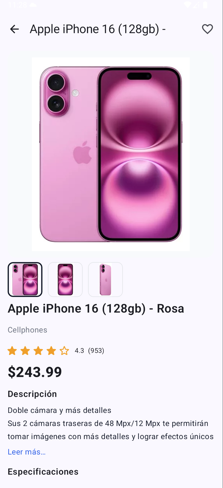

# MeliTest – Búsqueda y detalle de productos (Android / Compose)

App demo que consume **APIs de Mercado Libre** para:

1. Buscar productos
2. Ver resultados
3. Ver detalle de un producto

Construida con **Jetpack Compose**, **Hilt**, **Retrofit/Moshi**, **Coroutines/Flow** y **Navigation**. Incluye manejo de errores (dev + usuario), logs y **tests unitarios**.

---

## Tabla de contenido

* [Arquitectura](#arquitectura)
* [Pantallas](#pantallas)
* [APIs usadas](#apis-usadas)
* [Manejo de autenticación](#manejo-de-autenticación)
* [Manejo de errores y logs](#manejo-de-errores-y-logs)
* [Estado y rotación](#estado-y-rotación)
* [Cómo correr el proyecto](#cómo-correr-el-proyecto)
* [Testing](#testing)
* [Librerías](#librerías)
* [Estructura del proyecto](#estructura-del-proyecto)
* [Limitaciones y notas](#limitaciones-y-notas)
* [Mejoras futuras](#mejoras-futuras)
* [Capturas](#capturas)

---

## Arquitectura(MVVM + Clean Architecure)

* **Capas**: `data` (remoto + repositorios), `domain` (use cases + modelos), `presentation` (ViewModels + Compose UI).
* **DI**: Hilt.
* **Flujos**: ViewModel expone `StateFlow<UiState<…>>` hacia Compose.
* **Patrón de errores**: `safeApiCall` → mapea a `NetworkError` y registra con `Timber`.
* **Navegación**: Navigation Compose con parámetros (ej. `productId`).
* **Patron mas utilizado**: SIngleton.

---

## Pantallas

1. **Campo de búsqueda** (dentro del header de Resultados)

   * Chips rápidas (Autos, Música, etc.).
2. **Resultados de búsqueda / Explorar**

   * `LazyVerticalGrid` con `ProductCard` para visualizar los productos.
   * Banner promocional (CTA que lanza una búsqueda).
   * Vacío / Error / Loading skeleton.
3. **Detalle del producto**

   * Carrusel básico de fotos, atributos, categoría y descripción corta.

---

## APIs usadas

> Para este ejercicio se usaron los **endpoints de Catálogo** (requieren token).
> Se implementó fallback entre dos endpoints de catálogo:

* Búsqueda (primaria): `GET /products/search`
* Búsqueda (fallback): `GET /marketplace/products/search`
* Detalle: `GET /products/{product_id}`

> Nota: se intentó `/sites/{SITE_ID}/search` (público), pero en las pruebas devolvió `{"code":"unauthorized"}`, por eso la solución final quedó **con token** usando Catálogo.

---

## Manejo de autenticación

* El token se inyecta por `BuildConfig.MELI_ACCESS_TOKEN` (desde `local.properties`).
* Interceptor **Auth** agrega `Authorization: Bearer <token>` a las peticiones que llevan el header de marcador `@Headers("Requires-Auth: true")`.
* **No** se commitea el token. No se incluye `local.properties`.

**Configura tu token:**

1. Solicita/obtén un token de Mercado Libre (ambiente dev).
2. En `local.properties` edita:

   ```
   MELI_ACCESS_TOKEN=AQUI_VA_EL_TOKEN
   ```
3. Rebuild.

---

## Manejo de errores y logs

### Developer (logs + mapeo)

* `safeApiCall(callName) { ... }`:

  * `try/catch` → mapea a `NetworkError` (`Http`, `Network`, `Serialization`, `Unknown`).
  * Loggea con `Timber.e(t, "API call failed: %s -> %s", callName, mapped)`.
* `OkHttp` **HttpLoggingInterceptor** en debug (nivel `BODY`).
* `Timber` para trazas de ViewModels (warnings al fallar y reintentos/fallbacks).

### Usuario (feedback en UI)

* `UiState` → `Loading`, `Success`, `Empty`, `Error(mensaje)`.
* Estados visuales:

  * **Loading**: `LoadingGridSkeleton` para que el usuario sepa que esta cargando y tenga una experiencia buena.
  * **Empty**: mensaje y botón **Reintentar**.
  * **Error**: mensaje amigable de `toUserMessage()` y **Reintentar**.

---

## Estado y rotación

* **Compose**: `rememberSaveable` para inputs (query, chips) y `LazyGridState`.
* **ViewModel/SavedStateHandle**: persistimos `query` y `productId`.
* Rotación mantiene: texto de búsqueda, chip seleccionada, scroll del grid y último resultado.

---

## Cómo correr el proyecto

**Requisitos**

* Android Studio Koala+ / JDK 11
* Min SDK 24 / Target 36

**Pasos**

1. Clona el repo.
2. Agrega tu token:

   ```
   local.properties
   # Edita MELI_ACCESS_TOKEN=
   ```
3. Sync & run.

**Si el token expira**
Verás `401/403` en logs y la UI mostrará un error con reintentar. Actualiza `MELI_ACCESS_TOKEN`.

---

## Testing

* **Unit tests** (JVM):

  * Repositorio: verifica mapeo de DTO→UI y fallback (`/products/search` → `/marketplace/products/search`).
  * ViewModels: con `Turbine` (flujo `UiState`) y `MainDispatcherRule` (coroutines test).
* **Mocking**: `MockK`.
* **Coroutines**: `kotlinx-coroutines-test`.

**Ejecutar para correr todos los test**

```bash
./gradlew testDebugUnitTest
```

---

## Librerías

* **UI**: Compose BOM, Material3, Navigation.
* **DI**: Hilt.
* **Red**: Retrofit, Moshi, OkHttp Logging.
* **Imágenes**: Coil.
* **Animaciones**: Lottie (para placeholders).
* **Logs**: Timber.
* **Tests**: JUnit4, MockK, Turbine, Coroutines Test.


---

## Limitaciones y notas

* **Token requerido**: Catálogo exige `Bearer`. Para evaluar sin token, la app mostrará error amigable (no crashea).
* **Prices**: algunos datos (ej. precio) se completan con `FakeData` cuando API de Catálogo no los trae en el search.
* **/sites**: en el entorno devolvió `unauthorized` incluso con token; por eso se usó Catálogo + fallback Catálogo GS.

---

## Mejoras futuras

* Paginación/infinite scroll en resultados.
* Cache local (Room/Store).
* Test de UI (Compose test) para estados Loading/Error/Empty.
* Pull-to-refresh y filtros (envío gratis, ordenamientos).
* Renovación automática de token (OAuth completo).

---

## Capturas

### 1) Login


### 2) Busqueda


### 3) Resultados default 


### 4) Detalle



### 5) Estados – Loading / Empty / Error


### 6) Chips


